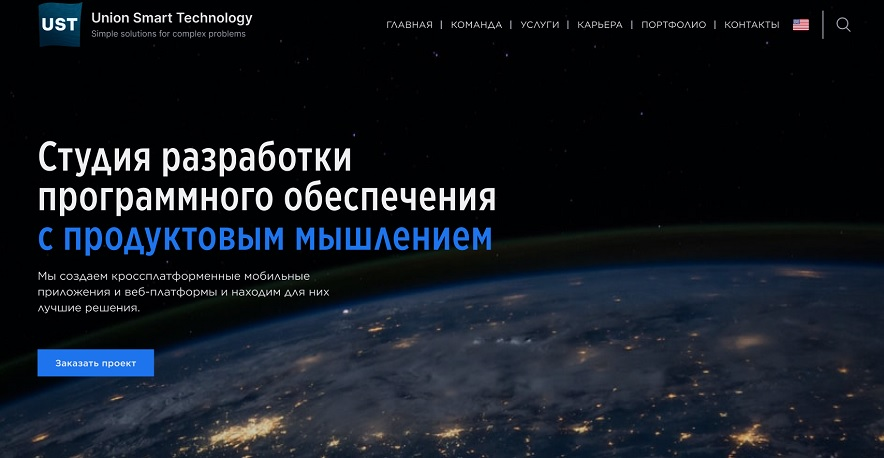
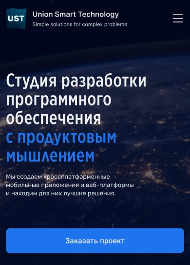

# Union Smart Technology - Simple solutions for complex problems #
   

Business website for IT company.

Technologies used by a website: HTML/CSS/SASS/JS.

[Github Pages](https://belskiy98.github.io/UST/)

Desktop version:

Mobile version:

[Original layout by figma](https://www.figma.com/file/kxCm8p1ouOQPhChSXOOFbE/UST?node-id=109%3A6388&mode=dev)
